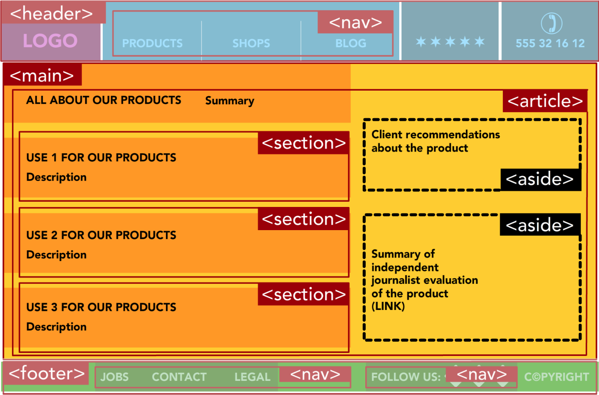
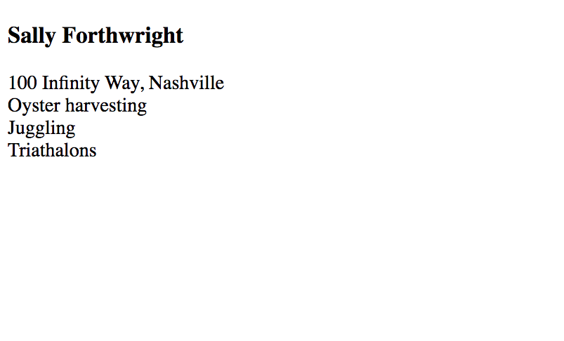
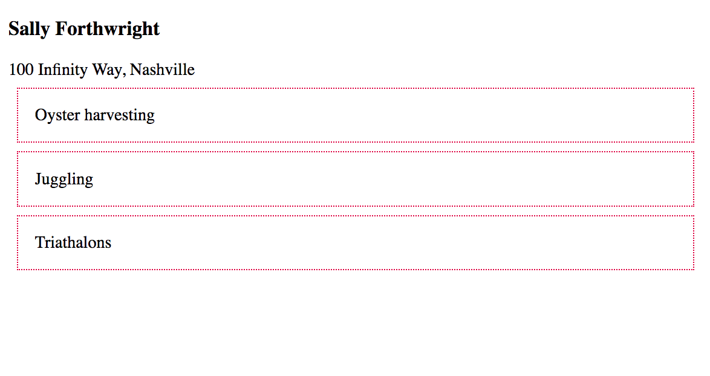
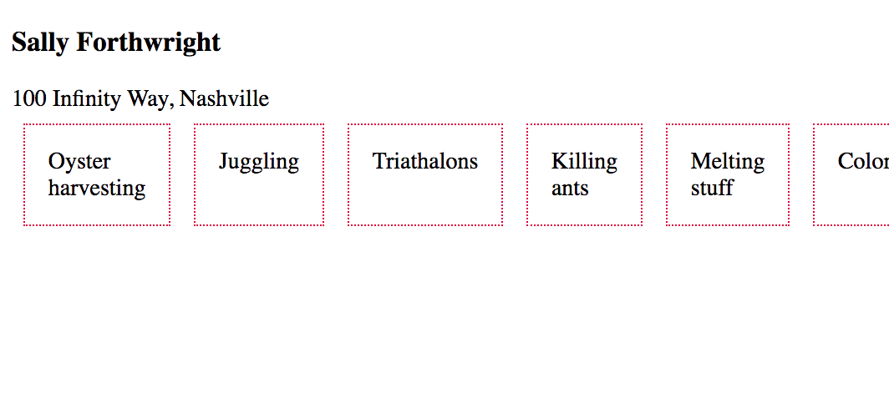
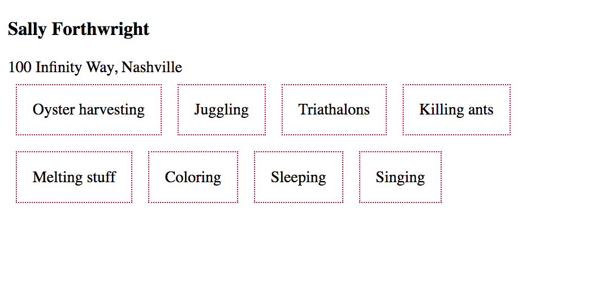
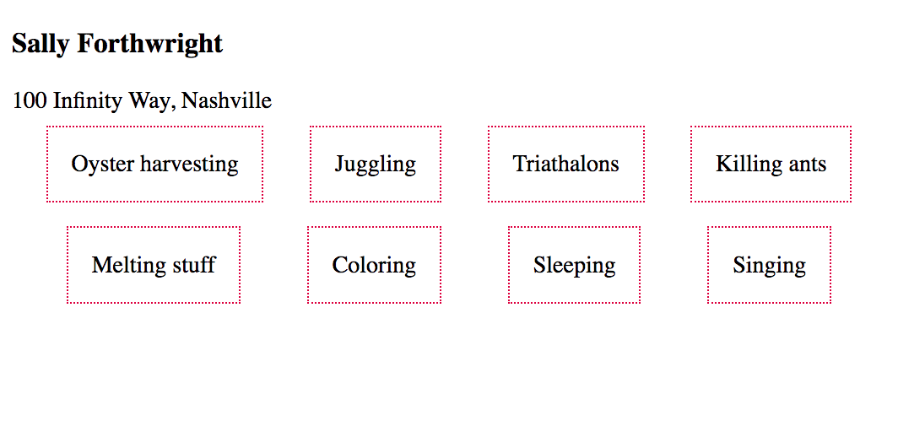
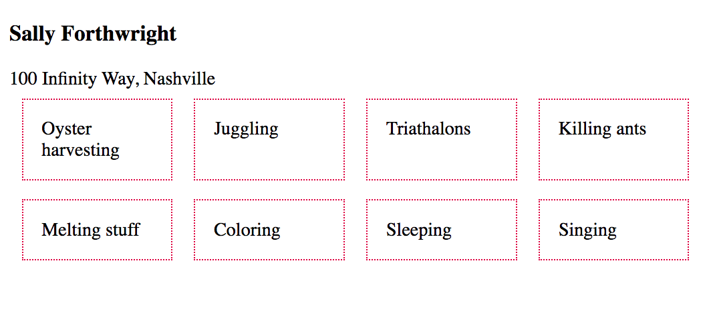
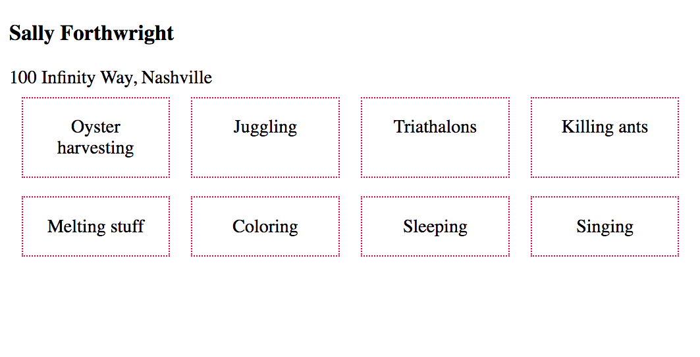
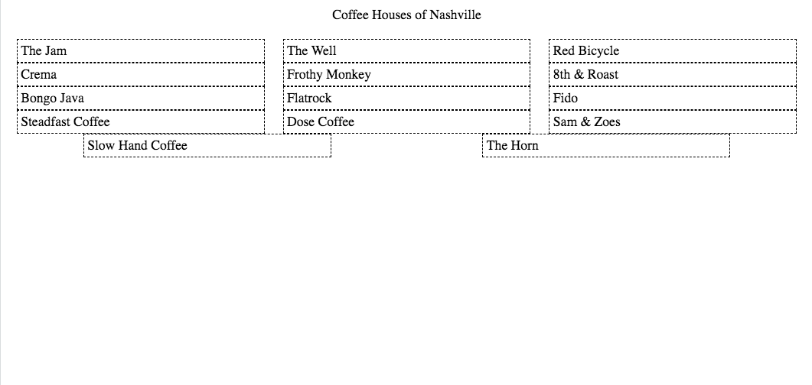

# Housekeeping things
1. Our passing around of links and code is difficult using iMesssage or Email. Discord will allow for a cross-platform computer-native approach to send messages. Here's the link to join the server: https://discord.gg/gej4KFd8
2. Reminder to get the backup drive set up on your machine

# Homework review
An [example](./song-functions.html) of last week's homework: Using a function to build lyrics.

# This week! CSS Flexbox

## Visual Review of Semantic Elements

What is a component and how do HTML elements apply to the concept? Look at the image below to see an overview of semantic HTML elements and how they are intended to be used together.



## Naming conventions
The BEM method http://getbem.com/introduction/ for naming the classes of your html elements

## Some HTML to get you started

```html
<main>
    <!-- Parent biography component -->
    <article class="bio">

        <!-- Child biography component -->
        <section class="bio__name">
            <h1>Sally Forthwright</h1>
        </section>

        <!-- Child biography component -->
        <section class="bio__address">
            100 Infinity Way, Nashville
        </section>

        <!-- Child biography component -->
        <section class="bio__interests">
            <div class="interest">
                Oyster harvesting
            </div>
            <div class="interest">
                Juggling
            </div>
            <div class="interest">
                Triathalons
            </div>
        </section>

    </article>
</main>
```

Each of those components can be styled individually with a clear, concise name that also provides some semantic context when looking at the CSS file. Before you style them, all you have is structure as some very basic, default styles that the browser applies to your elements.



Now you can style any HTML component with a class of `interest` and they will all look the same.

```css
.interest {
    border: 1px dotted crimson;
    padding: 1em;
    margin: 0.5em;
}
```



## Grid Layout with Flexbox

Flexbox is a tool that you can use in CSS to take the structure of your HTML and apply interesting layouts for it. One of the most common layout type is a grid, and it's straightforward to do with Flex.

Unfortunately, these Flexbox properties are hard to remember, so you should come back to this chapter and review them whenever you need to use Flexbox to make a grid layout.

You want those three interest to be all in the same row instead of each one being an entire row all by itself. The first thing you need to do is apply a style to the component in which all of those interests are contained. In your case, it's the `<section class="bio__interests">` component.

```css
.bio__interests {
    display: flex;  /* Display the child items in a Flex layout */
}
```


The `display: flex` property on a parent component immediately creates a row and puts all of the child elements in it. However, you're not quite done.

Add some more interests for Sally.

```html
<div class="interest">
    Killing ants
</div>
<div class="interest">
    Melting stuff
</div>
<div class="interest">
    Coloring
</div>
<div class="interest">
    Sleeping
</div>
<div class="interest">
    Singing
</div>
```



The default behavior is to put **all** child components into a single row, so you eventually run out of room if there are too many. You need to tell the browser that you want it to figure out how many can fit in a row, and when there's no more room, to create a new row.

```css
.bio__interests {
    display: flex;
    flex-wrap: wrap;  /* Let the rows wrap if there are too many */
}
```



Close, but you may not like that the rows are not aligned. The browser stops at figuring out how many will fit in the row. You have to provide the instructions for how to align them.

```css
.bio__interests {
    display: flex;
    flex-wrap: wrap;
    justify-content: space-evenly; /* Evenly space the child elements */
}
```




Sooooooo close, but the boxes aren't all the same size which is distracting noise to the human brain. We find it much more pleasing when things line up evenly.

```css
.interest {
    flex-basis: 16%;  /* Make each child element the same width */
    border: 1px dotted crimson;
    padding: 1em;
    margin: 0.5em;
}
```



The final touch is to center align the text in each of the interest boxes.

```css
.interest {
    flex-basis: 16%;
    border: 1px dotted crimson;
    padding: 1em;
    margin: 0.5em;
    text-align: center; /* Center align the text in the boxes */
}
```



The *final* product is [here](./sally.html)

## Additional References
1. [HTML Semantic Tag Cheatsheet](https://learn-the-web.algonquindesign.ca/topics/html-semantics-cheat-sheet/)
1. [CSS Tricks - Flexbox](https://css-tricks.com/snippets/css/a-guide-to-flexbox/)
1. [CSS Tricks - BEM](https://css-tricks.com/bem-101/)
1. [Introduction to BEM - A front-end methodology](https://www.youtube.com/watch?v=IO-4Z32O--c)

## Practice: Coffee Houses of Nashville

> The learning objective for this practice exercise is to use `display:flex` on a list component, and then add additional CSS properties to achieve a desired layout.

```html
<header class="pageHeader">Coffee Houses of Nashville</header>

<section class="list">
  <article class="shop">The Jam</article>
  <article class="shop">The Well</article>
  <article class="shop">Red Bicycle</article>
  <article class="shop">Crema</article>
  <article class="shop">Frothy Monkey</article>
  <article class="shop">8th &amp; Roast</article>
  <article class="shop">Bongo Java</article>
  <article class="shop">Flatrock</article>
  <article class="shop">Fido</article>
  <article class="shop">Steadfast Coffee</article>
  <article class="shop">Dose Coffee</article>
  <article class="shop">Sam &amp; Zoes</article>
  <article class="shop">Slow Hand Coffee</article>
  <article class="shop">The Horn</article>
</section>
```

From that HTML, use Flexbox to achieve this layout. You don't need to add the border to each coffee house component, but you can if you like. It's been added in this example to highlight the alignment and spacing you're shooting for.

